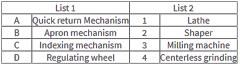

## Post test
 

Q 1. Which of the following is an inversion of four bar kinematic chain? 
<b>a. Reciprocating engine</b> 
b. Rotary engine 
c. Oscillating Engine 
d. Beam engine  

Q 2. “Inversions of Four Bar Chain”:Match list 1 with list 2 

 

a. A-3, B-2, C-1, D-4 
<b>b. A-2, B-1, C-3, D-4</b> 
c. A-4, B-2, C-3, D-1 
d. A-2, B-3, C-4, D-1  

Q 3. What is the Grashof linkage criterion? 
a. s+l>p+q 
<b>b. s+l<p+q</b> 
c. s+p>l+q 
d. s+p<l+q  

Q 4. How many equations in total are formed in the process of finding out the forces on each link? 
a. 3 
b. 6 
<b>c. 9</b> 
d. 12  

Q 5. How many forces are acting on each link due to other links? 
a. 2 
b. 3 
c. 4 
<b>d. 5</b>  

Q 6. What is the order of analysis of the four bar linkage? 
a. Position analysis, Velocity analysis, Dynamic Analysis, Acceleration analysis 
b. Dynamic Analysis, Acceleration analysis, Position analysis, Velocity analysis 
<b>c. Position analysis, Velocity analysis, Acceleration analysis, Dynamic Analysis</b> 
d. Dynamic Analysis, Position analysis, Velocity analysis, Acceleration analysis  

Q 7. How many degrees of freedom does a four bar mechanism have? 
a. 0 
<b>b. 1</b> 
c. 2 
d. 3  

Q 8. What is the shortest link for the following category of four bar mechanism? 
1.  Double crank (s + l < p + q)
2.  Double rocker (s + l < p + q) 

<b>a. Frame and coupler</b> 
b. Frame and side 
c. Coupler and side 
d. Coupler and frame  
