## INTRODUCTION 

#### Learning Objectives:

1. State the concepts of dynamic analysis of four bar mechanisms
2. Explain the significance of the parameter and select the variables accordingly. Parameters are velocity, angular velocity, acceleration, angular acceleration and forces. Variables are link lengths, mass of links, input angular velocity and torque.
3. Calculate the velocity, acceleration and force acting on each link.
4. Assess and compare velocity, acceleration, acceleration of CG, offset dimensions, force of the calculated value with the simulator.
5. Evaluate how change in length, angle and driving force results in change of acceleration, velocity and work done by the mechanism.

#### Theory
A four bar link mechanism or linkage is the most fundamental of the plane kinematics linkages. It is a much-preferred mechanical device for the mechanization and control of motion due to its simplicity and versatility<a href="references.html">[1]</a>. Basically, it consists of four rigid links which are connected in the form of quadrilateral by four pin joints. If a link completes its full rotation then it’s a crank motion and if it oscillates then rocker motion, the link opposite to the fixed link is the coupler and adjacent to fixed link are input and output link.

The dynamic analysis of the four bar mechanism is covered after understanding the kinematic analysis since the acceleration of the links are required to calculate the forces on the link. The analysis involves the offset analysis, acceleration of CG, forces on each link of four bar mechanism, with the help of position diagram, velocity and acceleration diagram.

OABC is a 4–bar mechanism. Link 2 rotates with constant angular velocity ω2. ,  & 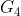 are the center of gravity and m2, m3 & m4 the masses of links 2, 3 & 4 respectively.

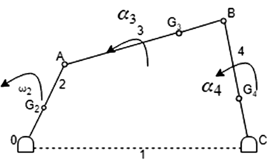

1. Draw the velocity & acceleration polygons for determine the linear acceleration of ,  & 

2. Magnitude and sense of 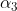 & 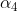(angular acceleration) are determined using the results of step 1.

To determine inertia forces and couples

Link 2:

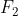 = accelerating force (towards O)

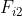 = inertia force (away from O)

Since  is constant, 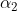 = 0 and no Inertia torque involved.

Link3:

Linear acceleration of   (i.e., 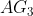 is in the direction of 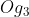 of acceleration polygon).

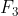 = accelerating force

Inertia force 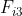 acts in opposite direction. Due to , there must be a resultant torque 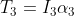 acting in the sense of  (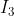 is MMI of the link about an axis through , perpendicular to the plane of paper). The inertia torque 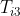 is equal and opposite of 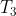.

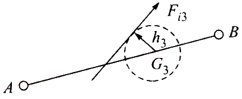

 can replace the inertia force  and the inertia torque .  is tangent to circle of radius 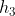 from  on the top side of it so as to oppose the angular acceleration 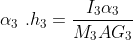

Link4:

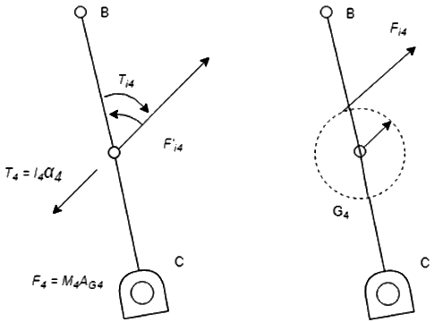

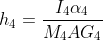&nbsp;&nbsp;&nbsp;<a href="references.html"> [2]</a>
 

(Equations Source: <a href="http://latex.codecogs.com/">latex.codecogs.com</a>)

