### Procedure

  Click on the Simulation icon    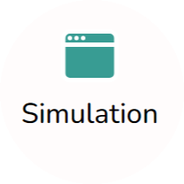  to view the simulation screen. 

   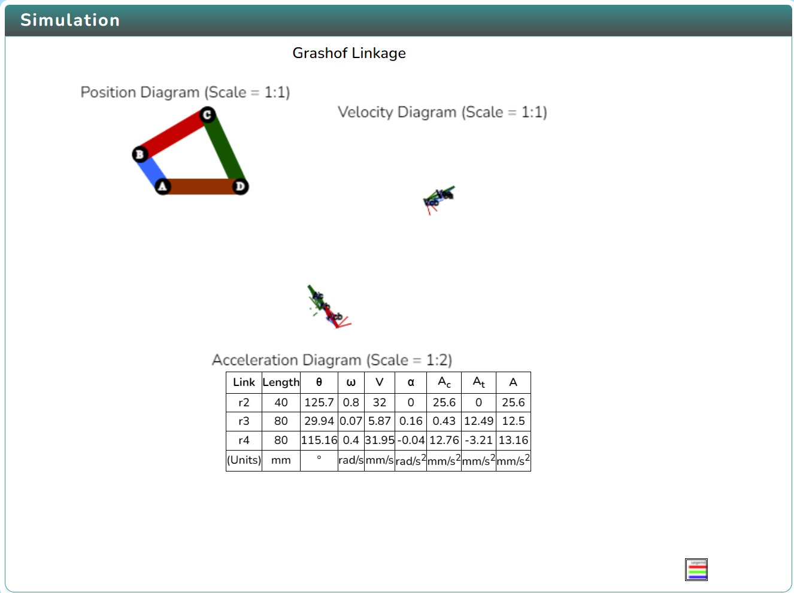
   
   In order to view the variable section click on the Variable icon. 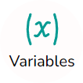 and to change the variables click on the Next or Previous button  inside the variable section.

   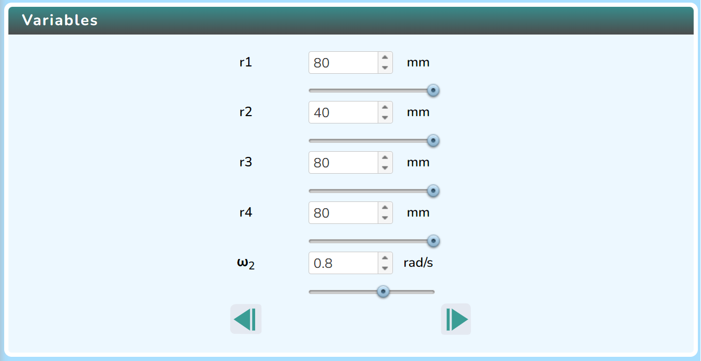
   

   Click on Play icon  to run the simulation and click on Pause icon 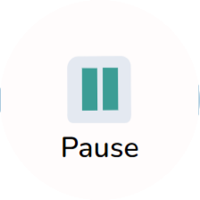 to stop it.

   Click on the Rotate icon   to change the direction of rotation.
   
    
 Click on the Next or Prev icon   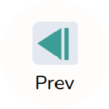 to cycle through different diagrams. After that, choose one of the experiments.

   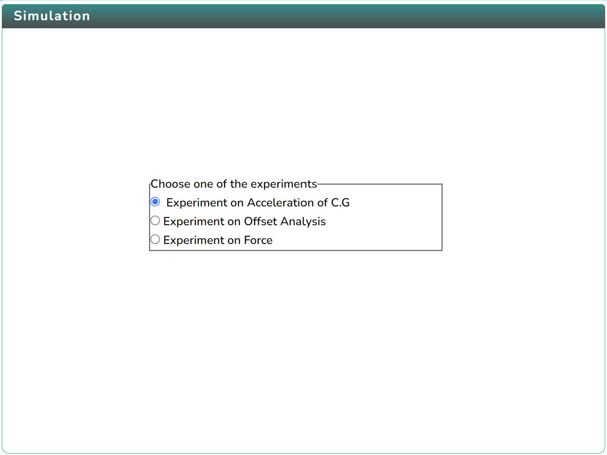

   After selecting the experiment, click on the "Start Experiment" button in the control section.

   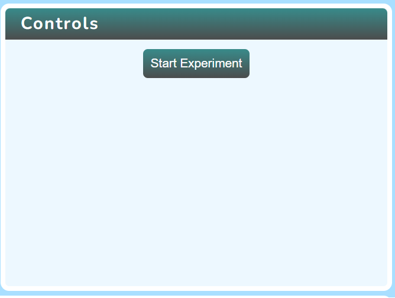

  Click the "Check" button to obtain the right answer after selecting the axis and entering the input values.
   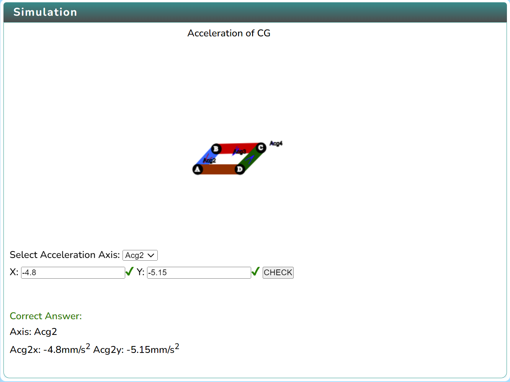

   Click on the "Stop Experiment" button to Reset or exit the experiment.

   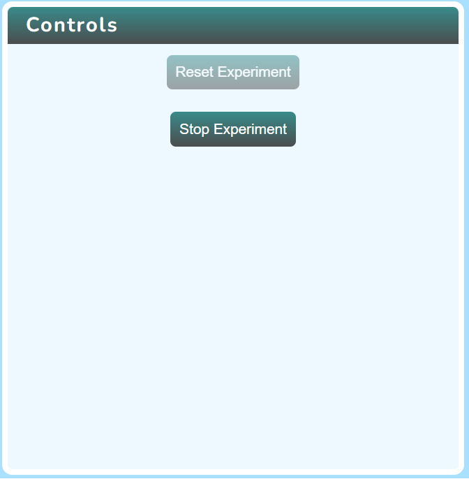

   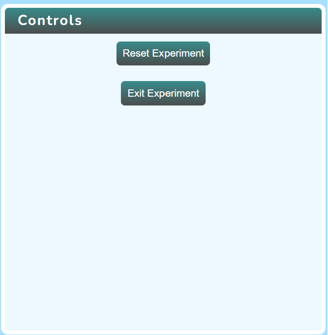

